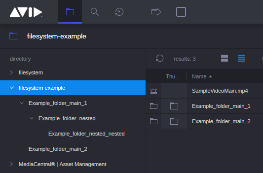

# CTMS Provider Example

## Introduction
This example create service with mocked video files and folders, that
are visible in MediaCentral | CloudUX Browse App.

## How to Run
1) Before you will be able run this project you need to prepare
and install [**proxy-bal**](http://developer.avid.com/connector_api/cloudux-starter-kit-service/development_guide/index.html).
2) You need to register service in your MediaCentral | CloudUX and add
proper **appID** and **appSecret** in [project.config.json](project.config.json)
3) Also in [project.config.json](project.config.json) at **hostIp** type your
MediaCentral | CloudUX machine address.
4) To make function visible in ACS Monitor you need to define it in config/service.ops.config.json file. With every change in that file you need to increment service version. You can do it in project.config.json. Otherwise the changes will not be loaded.
5) When you prepare files and proxy-ball type **npm install** for rest
of modules.
6) When you will download all modules type **npm start** to run this example.
7) Go to your MediaCentral | CloudUX and in **browse App** You will see mocked items.

## Mock Items
Items are mocked in **browse App** using [ctms_provider.json](ctms_provider.json)
Object are mocking folders, and **assets** Arrays are mocking video files.
If you want to prepare your own mock use Objects for folders and
**assets** Arrays in those object to create your own ctms provider.

## Next Steps
1) Add implementation for operation assets.
2) Add actions [**Actions API**](http://developer.avid.com/mcux_ui_plugin/clux-api/actions-api.html).
